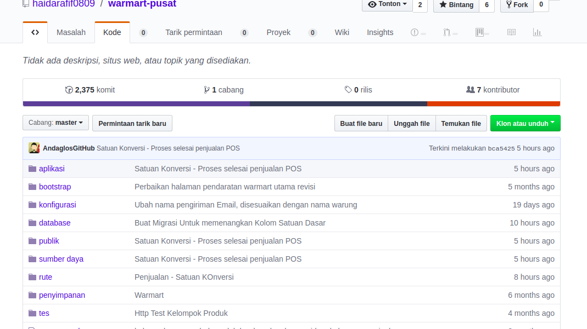

# Cara pemakaian git yang benar (1)
## Apa itu git? 
Git adalah sebuah version control yang digunakan untuk berkolaborasi antara programmer / developer dalam mengatur *source code* dari sebuah aplikasi /program. Meskipun belakangan git banyak juga digunakan bahkan oleh designer dalam mengorganisir *graphic* yang mereka buat, ya anda tidak salah baca. Bagaimana mungkin designer menggunakan git untuk me-*manage* file grafik? maaf ya, tidak dibahas pada artikel ini :D.

Baiklah, kembali ke git. Git dibuat oleh Linus Torvalds dan komunitas pengembangan linux, berbeda dengan version control yang lain seperti subversion, git merupakan distributed version control. Artinya, repository git berada terpencar-pencar dan anda bisa melakukan commit dan rollback langsung pada repository lokal anda, kemudian hasil commit/rollback tersebut bisa anda push ke repository server agar developer/programmer lain bisa mengaksesnya (checkout).

### Instalasi git di linux

Jika anda ingin melakukan instalasi git di linux anda bisa melakukannya dengan menggunakan binary installer. Anda bisa melakukannya melalui tool package management yang sudah termasuk di dalam distribusi linux yang anda miliki.  Jika anda menggunakan fedora anda bisa menggunakan perintah berikut:

~~~~ruby
yum install git-core
~~~~

Atau jika anda menggunakan distro linux turunan dari debian, semisal ubuntu, anda bisa menggunakan apt-get:

~~~~ruby
apt-get install git
~~~~

### Instalasi git di Windows

Bagi yang menggunakan Windows, anda bisa mengunduhnya di [http://msysgit.github.io](http://msysgit.github.io) , kemudian setelah anda unduh anda bisa jalankan file .exe nya seperti ketika anda menginstal aplikasi lainnya. Setelah git terinstal di windows, git bisa diakses baik melalui command line maupun GUI (Graphical User Interface). Untuk menggunakan git melalui GUI, anda bisa klik kanan pada folder repository anda kemudian pilih ‘Git Gui’, sedangkan untuk menggunakan git dengan command line, pilih ‘Git Bash’.

### Konfigurasi Git

Pertama kita arahkan terminal ke direktori projek kita

~~~~ruby
cd C:/xampp/htdoct/nama_direktori_kita
~~~~

lakukan instalasi repositori git:

~~~~ruby
git init
~~~~

maka akan muncul tulisan :

~~~~ruby
Initialized empty Git repository in /home/lumbung/repo/psb/.git/
~~~~

Masukkan semua aplikasi ke dalam antrian repositori

~~~~ruby
git add *
~~~~

Lihat status progresnya:
~~~~ruby
git status
~~~~

Lakukan commit terhadap file-file yang sudah masuk ke dalam daftar repo:
~~~~ruby
git commit -m "Contoh Commit Pertama"
~~~~

Langkah selanjutnya yaitu untuk melakukan *remoting* pada repositori pada projek anda dengan perintah : 

~~~~ruby
git remote add origin https://github.com/haidarafif0809/warmart-pusat.git
~~~~

bisa dicopy dari github di pojok kanan :

Kemudian ketik perintah selanjutnya untuk melakukan Pull dari Github ke lokal repo komputer kita :

~~~~ruby
git pull origin master
~~~~

 Dan yang terakhir, kita akan melakukan Push folder project aplikasi kita ke situs Github

~~~~ruby
git push origin master
~~~~

 Setelah itu, mari kita cek direktori repo yang telah kita buat.

 

 # Markdown (2)

 **Markdown** adalah sebuah markup language dengan plain text formatting **syntax** sehingga bisa di convert ke HTML dan format lainnya menggunakan tools yang sama. **Markdown** biasanya digunakan untuk mengedit readme dari sebuah open source, untuk menulis pesan di online forum, dan juga untuk membuat rich text dengan plain text editor. Lalu kenapa kamu harus setidaknya mengerti tentang Markdown?

 Bagi yang sering bermain di Github dan web serupa, pasti sering melihat markdown. Biasanya markdown digunakan untuk menuliskan dokumentasi.

Pada dasarnya markdown sama seperti HTML. Namun, lebih sederhana dan mudah dibaca.

Saat ini markdown sudah digunakan untuk:

- Dokumentasi;
- SSG (Static Site Generator);
- CMS seperti Ghost, Wordpress, Tumblr, dll.;
- Penulisan Buku;
- Format teks pada chat: Telegram, WA, Facebook;
- dll.

### Contoh Syntax
- Headers
- Emphasis
- Todo List atau Checklist
- Table
- Links
- Images

### Membuat Headers
Berfungsi untuk membuat tag header seperti

~~~~ruby
# H1
## H2
### H3
#### H4
##### H5
###### H6
~~~~

### Membuat Emphasis
Italic menggunakan *asterisks* atau *underscores* ( *  _ )

Bold menggunakan double *asterisks* atau *underscores*.  (** ** __ __)

Kombinasi emphasis biasanya di gunakan untuk membuat text bold dan italic secara bersama sama.

Strikethrough menggunakan 2 buah tildes ~~ ~~

~~~~ruby
*contoh text italic*
_contoh text italic_
 
**contoh text bold**
__contoh text bold__
~~~~

## Membuat Todo List atau Checklist
Sebenarnya ini pengembangan dari markdown. Tidak semua editor mendukung fitur ini.

~~~~ruby
- [x] Menulis artikel tentang markdown
- [ ] Belajar Git 
- [ ] Belajar Bahasa pemrograman Rust
- [x] Membuat template blog dengan bootstrap
~~~~

## Membuat Table

Tabel di markdown dapat dibuat dengan cara sperti ini:

~~~~ruby
| Name  | Age |
| ----- | --- |
| Bob   | 27  |
| Alice | 23  |
~~~~

## Membuat Links

~~~~ruby
[GitHub](http://github.com) 
~~~~

## Membuat Images
~~~~ruby

~~~~

Terkadang kita susah untuk menghapal suatu kode apalagi untuk dihapal diluar kepala 

Saya sendiri tidak begitu hapal semua kode markdown. yang kita harus lakukan adalah menulis sehari-hari dengan markdown.

Semua format markdown di atas adalah sebagaian kecil dari markdown.

Semakin sering diketik, semakin tajam pula ingatan kita. Sehingga tidak perlu dihapal. Terima kasi

# ES6 Variable (3)

ES6 adalah sebuah singkatan dari ECMAScript versi 6. ES6 release pada tahun 2015, jadi ES6 sama ES 2015 sama aja ya. Lalu apa itu ECMAScript? ECMAScript adalah sebuah standarisasi scripting language (Javascript) yang dibuat oleh European Computer Manufacturers Association (ECMA). Bahasa gampangnya ECMAScript itu standarnya, Javascript itu implementasinya.

Untuk menjalankan sebuah program yang ditulis menggunakan ES6 kalian dapat menggunakan NodeJS dengan command dibawah ini.

~~~~ruby
node namaFileJS
~~~~

## Variabel

Di dalam JavaScript kita tidak perlu mendeklarasikan jenis tipe data. Seluruh variabel di dalam JavaScript dapat berisi nilai apapun (tipe data apapun), dan dapat diubah menjadi tipe lain sepanjang program. Untuk mendeklrasikan sebuah variabel ada 3 cara yaitu menggunakan const, let, dan var.

**let dan var** : fungsi dari let dan var sebenarnya sama untuk mendeklarasikan variabel yang nilainya dapat diubah. Namun perbedaanya adalah var mempunyai cakupan dalam sebuah fungsi (function scope) dan let mempunyai cakupan dalam sebuah block (block scope). Bingung apa maksudnya? oke saya akan memberikan sebuah contoh melalui code.

> *Untuk mendapatkan experience lebih, harap tidak copy paste contoh code.*
>

*var (function scope)*

~~~~javascript
for (var i = 0; i < 5; i++) {
    console.log(i) // 0 1 2 3 4
}
console.log(i) // 5
~~~~

Jika code var-1.js dijalankan maka akan mengeluarkan output yang sesuai pada comment code baris 2 dan 4.

~~~~javascript
function looping() {
  for (var i = 0; i < 5; i++) {
    console.log(i); // 0 1 2 3 4
  }
}
looping();
console.log(i); // ReferenceError: i is not defined
~~~~

Nah gimana kalau code var-2.js dijalankan? program akan mengeluarkan output *ReferenceError: i is not defined*. Kenapa? karena varibel i di deklarasikan menggunakan var di dalam function looping(). Sedangkan pada baris 7 kita memanggi variabel i di luar function looping(). Hal ini menunjukan jika var berjalan pada cakupan function (*function scope*).

~~~~javascript

function looping() {
  for (var i = 0; i < 5; i++) {
    console.log(i); // 0 1 2 3 4 5
  }
  function inLooping() {
    console.log(i); // 5
  }
  inLooping();
}
looping();
~~~~

Bagaimana jika code var-3.js dijalankan? apakah ada yang bingung kenapa baris 6 tidak error padahal variabel i tidak dalam scope *function inLooping()* ? ini dikarenakan *function inLooping()* masuk ke dalam scope *function looping()*. Oleh karena itu variabel i pada baris 6 dapat dipanggil.

>*Kesimpulannya variabel yang dideklarasikan menggunakan var hanya dapat dipanggil dalam cakupan sebuah fungsi dimana variabel tersebut dideklarasikan. Child function juga dapat memanggil variabel yang dideklarasikan menggunakan var pada root functionnya (contohnya seperti code var-3.js)*

# Literal Template (4)

Literal adalah konstruksi sintaksis yang menghasilkan nilai. Contohnya termasuk literal string (yang menghasilkan string) dan literal ekspresi reguler (yang menghasilkan objek ekspresi reguler). ECMAScript 6 memiliki dua literal baru:

- *Literal template* adalah *literal* string dengan dukungan untuk interpolasi dan banyak baris.
- *Literal template yang diberi tag* (short: *tagged templates* ): adalah panggilan fungsi yang parameternya disediakan melalui literal template.

Penting untuk diingat bahwa nama-nama literal template dan templat yang ditandai agak menyesatkan. Mereka tidak ada hubungannya dengan template , seperti yang sering digunakan dalam pengembangan web: file teks dengan kosong yang dapat diisi melalui (misalnya) data JSON.

## Literal template
 
 Literal template adalah jenis baru dari string literal yang dapat menjangkau banyak garis dan *menginterpolasi* ekspresi (termasuk hasilnya). Sebagai contoh:

~~~~javascript

 const firstName = 'Jane';
console.log(`Hello ${firstName}!
How are you
today?`);
// Output:
// Hello Jane!
// How are you
// today?

~~~~

## Escaping dalam literal template

Backslash digunakan untuk melarikan diri di dalam literal template.
Ini memungkinkan Anda untuk menyebutkan backticks dan ${dalam literal template:

> `\\`
'\\'
> `\ n`
'\ n'
> `\ u {58}`
'X'

## Terminator baris dalam literal template selalu LF ( \n)

Cara umum untuk mengakhiri garis adalah:

- Umpan baris (LF,, \nU + 000A): digunakan oleh Unix (termasuk macOS saat ini)
- \rPengembalian kereta (CR,, U + 000D): digunakan oleh Mac OS lama.
- CRLF ( \r\n): digunakan oleh Windows.

Semua terminator garis ini dinormalisasi ke LF dalam literal template. Yaitu, kode berikut ini mencatat truesemua platform:

~~~~javascript

const str = `BEFORE
AFTER`;
console.log(str === 'BEFORE\nAFTER'); // true

~~~~

## Literal template yang diberi tag

Berikut ini adalah *literal template* yang ditandai (short: *tagged template* ):

~~~~javascript
tagFunction`Hello ${firstName} ${lastName}!`
~~~~

Menempatkan template literal setelah ekspresi memicu pemanggilan fungsi, mirip dengan bagaimana daftar parameter (nilai yang dipisahkan koma dalam tanda kurung) memicu panggilan fungsi. Kode sebelumnya setara dengan pemanggilan fungsi berikut (pada kenyataannya, parameter pertama lebih dari sekadar Array, tetapi yang dijelaskan kemudian).

~~~~javascript
tagFunction(['Hello ', ' ', '!'], firstName, lastName)
~~~~

Dengan demikian, nama sebelum konten di backticks adalah nama fungsi untuk dipanggil, *fungsi tag* . Fungsi tag menerima dua jenis data yang berbeda:

- String template seperti 'Hello '.
- Substitusi seperti firstName(dibatasi oleh ${}). Substitusi dapat berupa ekspresi apa pun.

Template string dikenal secara statis (pada waktu kompilasi), penggantian hanya diketahui pada saat runtime. Fungsi tag dapat dilakukan dengan parameternya seperti yang diinginkan: Dapat benar-benar mengabaikan string template, mengembalikan nilai dari jenis apa pun, dll.

Selain itu, fungsi tag mendapatkan dua versi dari setiap string template:

- Versi “mentah” di mana backslashes tidak ditafsirkan ( `\n`menjadi '\\n', string panjang 2)
- Versi “dimasak” di mana backslash adalah spesial ( `\n`menjadi string hanya dengan baris baru di dalamnya).

Itu memungkinkan String.raw(yang dijelaskan kemudian) untuk melakukan tugasnya:

~~~~ruby
String.raw` \ n` === '\\ n'
benar
~~~~

# Named Argument (5)

## Perbaiki argumen Anda dengan lebih bersih menggunakan perusakan ES6

Destrukturisasi mungkin merupakan perubahan sintaksis terbesar yang datang ke JavaScript dalam spesifikasi ES6. Sementara sintaks yang baru mungkin tampak aneh bagi banyak programmer JavaScript lama, setelah Anda dapat membungkus kepala Anda di sekitarnya, menggunakannya bisa sangat kuat.

Jika Anda belum terbiasa dengan perusakan, itu adalah kemampuan untuk memetakan objek literal atau array literal ke beberapa pernyataan penugasan pada saat yang bersamaan. Sebagai contoh:

Destrukturisasi dapat digunakan dengan sintaks array untuk menetapkan setiap nilai dalam array ke nama variabel dalam posisi yang sesuai dari array sisi kiri.

~~~~ruby
//Destructuring using an array
let [a,b,c] = [1,2,3];
console.log(a,b,c) // 1, 2, 3
~~~~

Lebih umum, bagaimanapun, itu dapat digunakan dengan objek literal untuk menarik keluar properti dari objek yang ingin Anda gunakan sebagai variabel.

~~~~ruby
//Destructuring using an object literal. 
//Must be the same property name
let {x,y,z} = {x: 10, y: 20, z: 30};

console.log(x,y,z); //10, 20, 30
~~~~

**Catatan**  - Dalam contoh literal objek di atas, nama properti harus sama. Posisi tidak menjadi masalah di sini tidak seperti contoh larik.

Jika Anda ingin mengganti nama saat merusak, Anda dapat menggunakan 
~~~~ruby 
keyName:newKey
~~~~
sintaks di sisi kiri perusakan Anda.

~~~~ruby
//If you want to rename your properties...
let {x:newX,y:newY,z:newZ} = {x: 10, y: 20, z: 30};

console.log(newX,newY,newZ); //10, 20, 30
~~~~

Pada awalnya, ini mungkin tampak seperti beberapa gula sintaksis pada pernyataan penugasan, tetapi yang membuatnya jauh lebih dari itu adalah kemampuan untuk menetapkan nilai default ke variabel pada saat merusak.

~~~~ruby
let {x = 5, y = 8, z = 13} = {x: 10, y: 20};

console.log(x,y,z); //10, 20, 13
~~~~

Ini sangat signifikan. Katakan bahwa sisi kanan ekspresi tugas bukan literal objek tetapi panggilan berfungsi di bagian lain aplikasi Anda. Suatu hari, seorang pengembang datang dan mengimplementasikan pernyataan pengembalian arus pendek dalam fungsi lain itu dan sekarang panggilan Anda tidak mendapatkan respons yang diharapkan. Mampu mengatur default pada saat penugasan membuat pengamanan kode Anda jauh lebih mudah.

## Parameter Fungsi Destrukturisasi

Ketika Anda mengoper argumen ke fungsi, sebelum fungsi itu mulai dijalankan, ia menetapkan argumen yang Anda berikan ke parameter yang sesuai dalam tanda fungsinya. Karena ini adalah pernyataan penugasan, itu artinya kita dapat menggunakan perusakan untuk memberikan nilai parameter dalam suatu fungsi!

~~~~ruby
//destructuring to assign parameters
let myFunc = function({x,y,z}) {
    console.log(x,y,z);
};

myFunc({x:10,y:20,z:30}); //10 20 30
~~~~

Sama seperti yang ditunjukkan sebelumnya, kami juga dapat mengganti nama kunci kami selama melakukan perusakan.

~~~~ruby
//you can also rename them as before
myFunc = function({x:newX,y:newY,z:newZ}) {
    console.log(newX,newY,newZ);
};

myFunc({x:10,y:20,z:30}); //10 20 30
~~~~

Terakhir, kita dapat menetapkan nilai default untuk **kedua** kunci individu dalam pernyataan perusakan dan seluruh blok itu sendiri.

~~~~ruby
//setting defaults on the individual values and the whole object works too
myFunc = function({x = 5,y = 8,z = 13} = {x:1,y:2,z:3}) {
    console.log(x,y,z);
};

myFunc(); //1 2 3  (hits the object literal default)
myFunc({}); //5 8 13   (hits the value defaults)
~~~~

Sementara ini tampaknya agak membosankan untuk mengetik, itu mencegah kita dari harus memeriksa keberadaan setiap argumen yang kita lewati.

## Bernama dan Argumen Opsional

Jika Anda ingat contoh pertama dari menetapkan nilai default saat merusak dan menggabungkan itu dengan apa yang kita pelajari di bagian terakhir, Anda mungkin tahu di mana saya akan pergi dengan ini. Jika Anda dapat merusak parameter fungsi, dan Anda dapat menetapkan nilai default saat merusak, DAN nama objek literal harus cocok selama proses destrukturisasi, ini berarti bahwa Anda dapat memiliki parameter bernama dan opsional dalam tanda tangan fungsi Anda! (selama Anda menggunakan perusakan). Berikut ini contohnya:

~~~~ruby
let myFunc = function({x = 5,y = 8,z = 13} = {}) {
    console.log(x,y,z);
};

myFunc({y:15,x:10,a:1}); //10 15 13
~~~~

